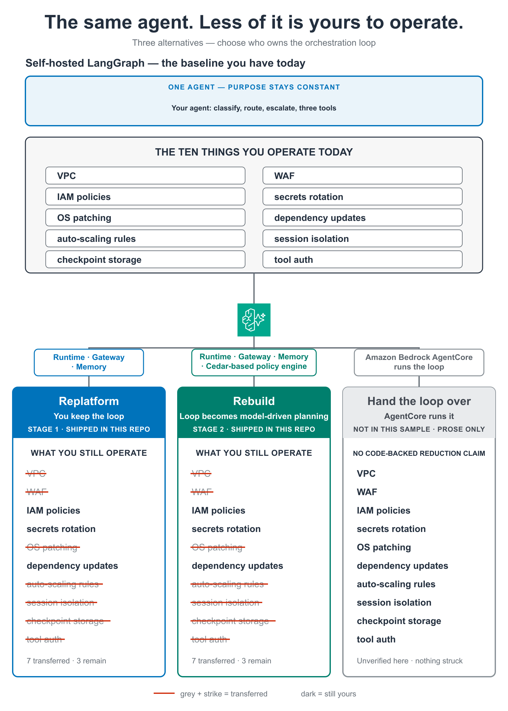

# Migrating Agentic Workloads to Amazon Bedrock AgentCore

This repository contains sample code for the AWS blog post [Migrating agentic workloads to Amazon Bedrock AgentCore from other platforms](https://aws.amazon.com/blogs/machine-learning/). It demonstrates how to migrate existing AI agents from frameworks like LangGraph and CrewAI to [Amazon Bedrock AgentCore](https://aws.amazon.com/bedrock/agentcore/).

> **Important:** This sample code is for demonstration and educational purposes only. Review and adapt security configurations, error handling, and resource sizing for your production environment.

## Architecture



## Overview

The samples show two migration paths:

- **Replatform**: Wrap your existing agent (LangGraph, CrewAI) with `BedrockAgentCoreApp` to run on AgentCore Runtime without rewriting agent logic.
- **Rebuild**: Rewrite your agent using the [Strands Agents SDK](https://github.com/strands-agents/sdk-python) for tighter AgentCore integration and model-driven orchestration.

## Repository structure

```
Dockerfile                          # Sample ARM64 container for AgentCore Runtime
examples/
├── replatform/
│   ├── langgraph_agent.py      # Wrap a LangGraph agent for AgentCore Runtime
│   └── crewai_agent.py         # Wrap a CrewAI agent for AgentCore Runtime
├── rebuild/
│   └── strands_agent.py        # Rebuild with Strands Agents SDK
├── tools/
│   ├── gateway_mcp_tools.py    # Connect existing APIs via AgentCore Gateway (MCP)
│   └── inventory_tools.py      # Inventory existing tools before migration
├── memory/
│   └── configure_memory.py     # Set up AgentCore Memory (summary, preference, semantic)
└── validation/
    └── validate_migration.py   # Validate agent behavior post-migration

docs/
└── security-comparison.md      # Security architecture: self-hosted vs. AgentCore

.github/workflows/
└── deploy-agent.yml            # CI/CD pipeline for ARM64 builds and AgentCore deployment (manual trigger)
```

## Prerequisites

- An [AWS account](https://aws.amazon.com/free/) with [Amazon Bedrock](https://aws.amazon.com/bedrock/) model access enabled
- Python 3.10 or later
- [AWS CLI](https://docs.aws.amazon.com/cli/latest/userguide/getting-started-install.html) installed and configured

## Getting started

1. Clone this repository:

```bash
git clone https://github.com/aws-samples/sample-migrate-agents-to-amazon-bedrock-agentcore.git
cd sample-migrate-agents-to-amazon-bedrock-agentcore
```

2. Run the setup script (creates a virtual environment, installs dependencies, verifies AWS credentials):

```bash
./setup.sh
```

3. Activate the environment and run an example:

```bash
source .venv/bin/activate
python examples/rebuild/strands_agent.py
```

Alternatively, install manually:

```bash
python3 -m venv .venv
source .venv/bin/activate
pip install -r requirements.txt
```

## Additional resources

- [Security architecture comparison](docs/security-comparison.md): Side-by-side comparison of security responsibilities when running agents on self-hosted infrastructure vs. Amazon Bedrock AgentCore.
- [CI/CD deployment workflow](.github/workflows/deploy-agent.yml): Sample GitHub Actions pipeline for building ARM64 containers and deploying to AgentCore Runtime. Uses `workflow_dispatch` (manual trigger only).

## Clean up

If you created AWS resources while following the examples, delete them to avoid ongoing charges:

1. Remove AgentCore Runtime deployments from the [Amazon Bedrock console](https://console.aws.amazon.com/bedrock/).
2. Delete AgentCore Gateway API configurations.
3. Remove AgentCore Memory stores.
4. Delete the test IAM roles or policies you created.

## Security

See [CONTRIBUTING](CONTRIBUTING.md#security-issue-notifications) for more information.

## License

This library is licensed under the MIT-0 License. See the [LICENSE](LICENSE) file.
